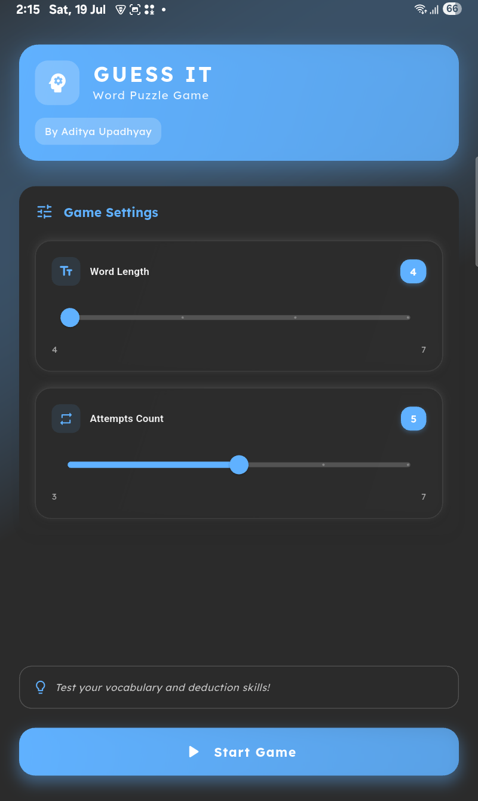
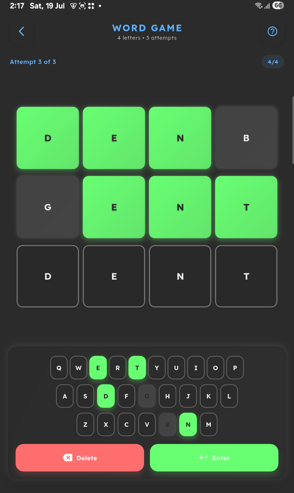
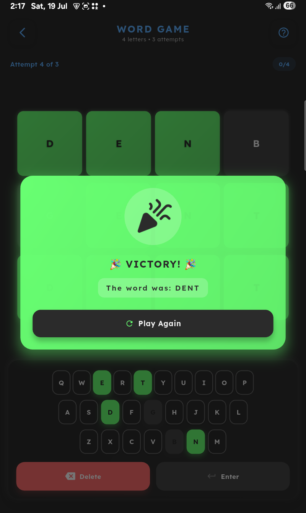
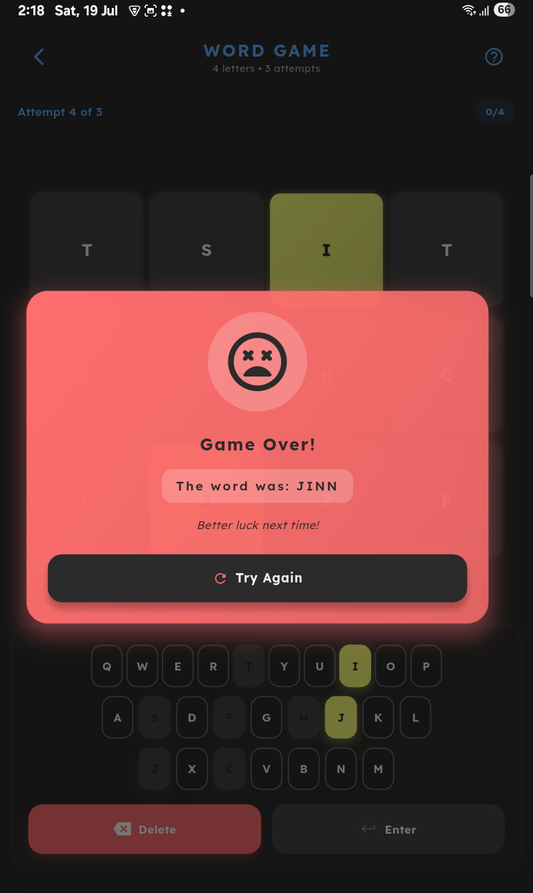

# Guess It - Word Puzzle Game  

<p align="center">
  
</p>

A Wordle-inspired word guessing game built with Flutter, featuring customizable difficulty and sleek animations.

## 🎮 Features  
- 🔠 **Adjustable word length** (4-7 letters)  
- 🔢 **Custom attempt limits** (3-7 tries)  
- 🎨 **Color feedback system** (Green/Yellow tiles)  
- 📱 **Haptic feedback** on interactions  
- ✨ **Smooth animations** for tile flips and wins  
- 🌈 **Modern UI** with gradient backgrounds  

## 🛠 Tech Stack  
- **Flutter** (Dart)  
- **BLoC Pattern** for state management  
- **GoRouter** for navigation  
- **GetIt** for dependency injection  

## 📸 Screenshots  
| Home Screen | Gameplay | Win Dialogs | Loss Dialogs |
|-------------|----------|------------------|---------------|
|  |  |  |  |

<p align="center">
  
  <br>
  <video src="https://github.com/2D-array/word-game/blob/main/app.mp4" width="400" controls></video>
</p>

## 🚀 Installation  
1. Clone the repository:  
   ```bash
   git clone https://github.com/your-username/word_game.git
